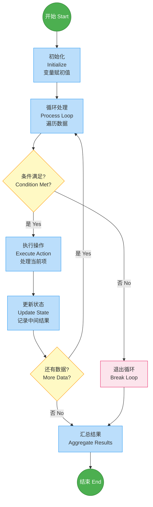
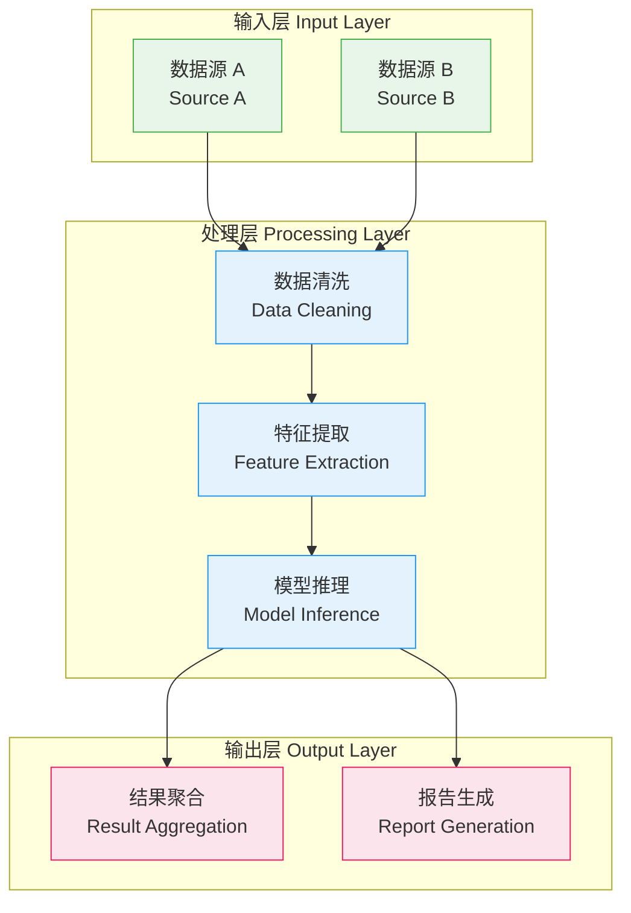
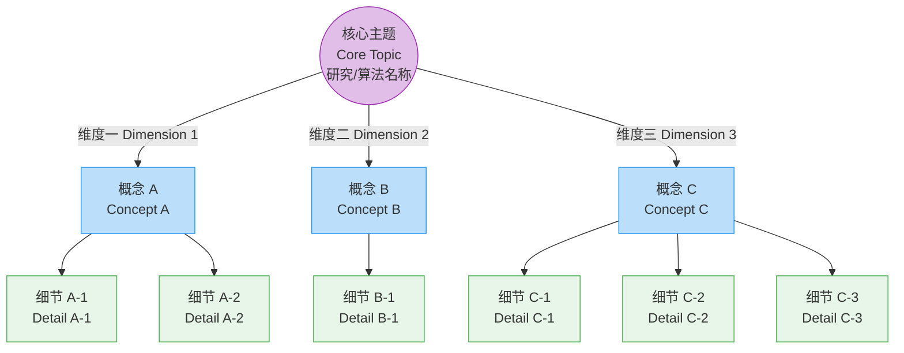
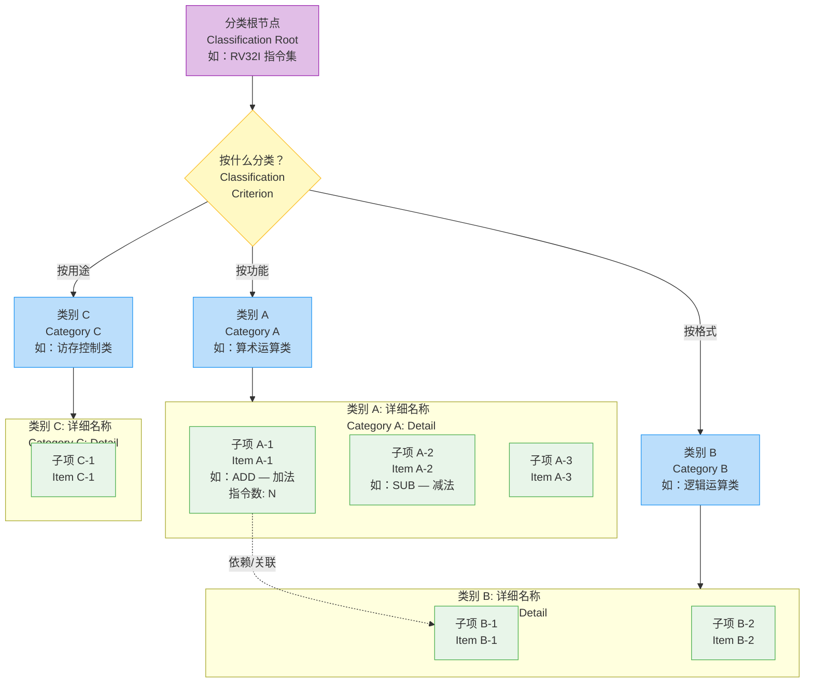
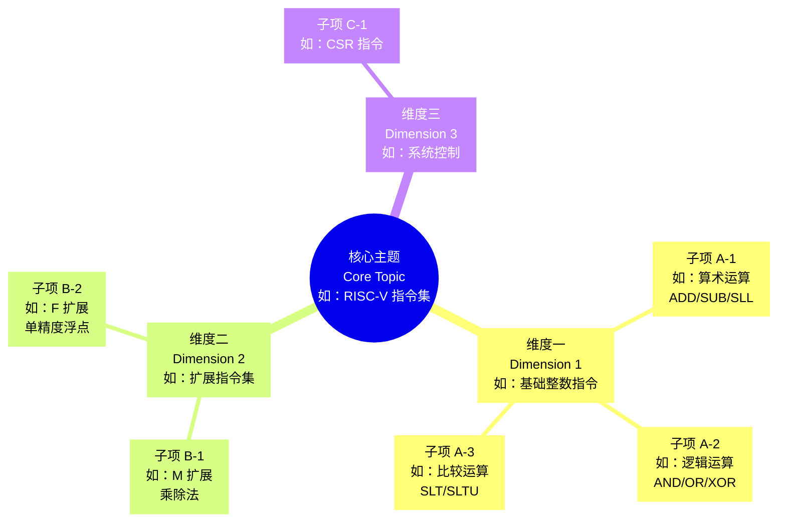
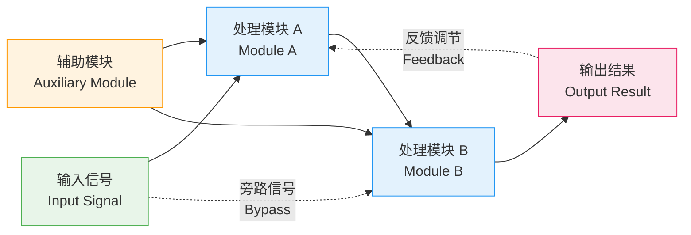
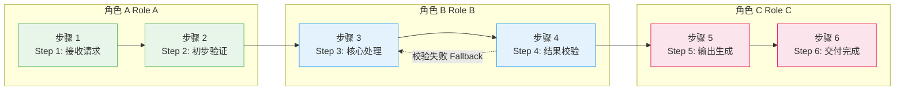
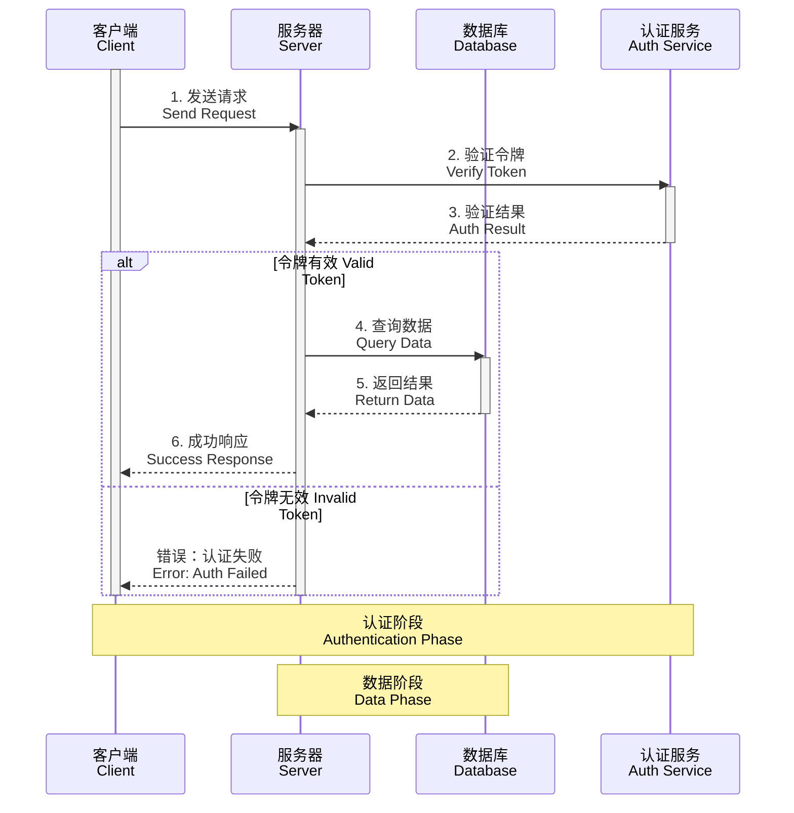
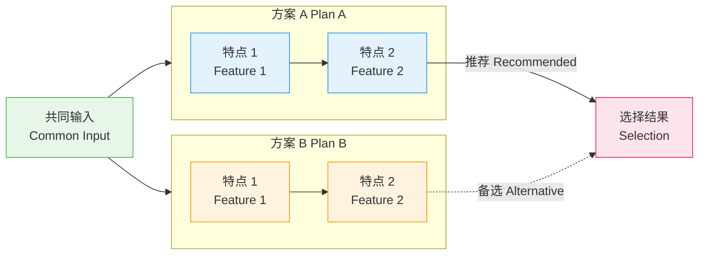

# Mermaid 语法模板 — 六类图表

> 每个模板均可直接复制使用，包含中文标签和英文注释。
> 标准调色板：绿色 #4CAF50、蓝色 #2196F3、橙色 #FF9800、红色 #E91E63、紫色 #9C27B0

---

## A. 流程图 (Flowchart)

<!-- 使用 flowchart TD（上到下），包含开始/结束（圆形）、处理（矩形）、判断（菱形）、循环回边 -->



**关键语法说明**：
- `flowchart TD` — 上到下布局（也可用 `LR` 左到右）
- `(())` — 圆形节点（开始/结束）
- `[]` — 矩形节点（处理步骤）
- `{}` — 菱形节点（判断/决策）
- `-->|标签|` — 带标签的边
- `<br/>` — 节点内换行
- `classDef` — 样式定义，`class` 关键字批量应用

---

## B. 框架图 (Framework Diagram)

<!-- 使用 flowchart TD + subgraph 表示分层结构 -->



**关键语法说明**：
- `subgraph LABEL["显示名"]` — 子图分组表示层
- 层内节点用 `-->` 串联，层间也用 `-->` 连接
- 每层使用独立 classDef，视觉上区分职责

---

## A-bis. 技术路线图 / Timeline

<!-- 使用 timeline 语法，按阶段展示任务和里程碑，无需具体日期 -->

```mermaid
timeline
    title 技术路线图标题<br/>Technology Roadmap Title
    section 阶段一 基础研究<br/>Phase 1: Foundation
        任务 1.1 研究现状分析<br/>Literature Review : 交付物：技术报告<br/>Deliverable: Technical Report
        任务 1.2 工具链搭建<br/>Toolchain Setup : 交付物：开发环境<br/>Deliverable: Dev Environment
    section 阶段二 核心实现<br/>Phase 2: Implementation
        任务 2.1 关键模块设计<br/>Module Design : 交付物：设计文档<br/>Deliverable: Design Doc
        任务 2.2 编码与单元测试<br/>Coding & Testing : 交付物：可运行原型<br/>Deliverable: Prototype
    section 阶段三 验证优化<br/>Phase 3: Validation
        任务 3.1 集成测试<br/>Integration Test : 交付物：测试报告<br/>Deliverable: Test Report
        任务 3.2 性能优化<br/>Optimization : 交付物：最终版本<br/>Deliverable: Final Release
```

**关键语法说明**：
- `timeline` — Mermaid 时间线语法（v9.3+），无需具体日期
- `title` — 图表标题
- `section` — 阶段分组（每个 section 自动换色）
- `任务名 : 交付物描述` — 每行一个任务，冒号后为补充描述
- **不支持 `classDef`**：使用内置配色方案
- **已知渲染 bug**：section 标题和 task 文本中避免使用 `<br/>` 和英文冒号 `:`（会触发 addEvent TypeError）。如需换行，将内容拆分为多个 task
- 若需表达并行/依赖关系，回退到 A 类 flowchart + subgraph 模板
- 适用于 A4 技术路线图、研究路径图、项目阶段规划等场景

---

## C. 概念图 (Concept Map)

<!-- 使用 graph TD（无向），中心节点辐射展开 -->



**关键语法说明**：
- `graph TD` — 无向图（flowchart 是有向的，graph 是无向的）
- 中心节点用 `((" "))` 双括号突出
- 一级到二级用简短边标签说明关系
- 层次通过 classDef 颜色区分（中心/一级/二级）

---

## C-bis. 分类图 / Taxonomy (flowchart + subgraph)

<!-- 使用 flowchart TD + 嵌套 subgraph，强调分类标准和层级 -->



**关键语法说明**：
- `flowchart TD` + 菱形 `{" "}` 中间层增加结构深度（分类标准层）
- `subgraph` 按类别分组，视觉上隔离不同类别
- 每个子项包含：名称 + 英文 + 具体示例/数量，提升信息粒度
- `-.->` 虚线表示跨类别关联（可选），增加语义丰富度
- 适用于 C3 分类图、C4 术语关系图等需要层级分类的场景

---

## C-ter. 概念拆解图 (mindmap 语法)

<!-- 使用 mindmap 语法，自动辐射布局，适合纯层级概念 -->



**关键语法说明**：
- `mindmap` — Mermaid 专用思维导图语法（v9.4+）
- `root(( ))` — 圆形根节点，用双括号
- `[" "]` — 可选的方括号文本，支持 `<br/>` 换行
- **缩进表示层级**：2 空格 = 一级分支，4 空格 = 二级子项，以此类推
- **不支持 `classDef`**：使用内置配色，无法自定义颜色
- **只支持树形结构**：不支持交叉连接（跨分支关联）
- 适用于 C1 概念图、C2 概念拆解图、纯层级无交叉的 C3 分类图等场景
- 当概念间有复杂交叉关系时，使用 C-bis 分类图模板（flowchart）更合适

---

## D. 机制图 (Mechanism)

<!-- 使用 graph LR，双向边 + 反馈环 -->



**关键语法说明**：
- `graph LR` — 左到右布局，适合展示流程机制
- `-->` 实线箭头表示主路径
- `-.->` 虚线箭头表示反馈/辅助路径（注意 Mermaid 的虚线语法）
- 反馈环是机制图的核心特征，从输出回到中间节点

---

## E. 泳道图 (Swimlane Diagram)

<!-- 使用 flowchart LR + subgraph 表示泳道 -->



**关键语法说明**：
- `flowchart LR` — 横向排列泳道
- 每个 `subgraph` 代表一条泳道（一个角色/部门）
- `direction TB` — 泳道内部节点纵向排列
- 跨泳道用 `-->` 连接，形成完整流程
- 回退/异常路径用 `-.->` 虚线箭头

---

## E-bis. 时序图 (Sequence Diagram)

<!-- 使用 sequenceDiagram 展示多参与者之间的消息时序 -->



**关键语法说明**：
- `participant` — 定义参与者（角色/系统）
- `->>` — 实线箭头（同步请求）
- `-->>` — 虚线箭头（异步响应/返回）
- `-x` — 叉号箭头（请求失败）
- `activate/deactivate` — 激活条（显示处理中状态）
- `alt/else/end` — 条件分支
- `loop ... end` — 循环
- `par ... and ... end` — 并行
- `Note over A,B:` — 跨参与者注释
- **注意**：sequenceDiagram 不支持 `classDef` 样式定义

---

## F. 总结图 (Summary)

<!-- 使用 graph LR 做对比，简洁高亮 -->



**关键语法说明**：
- `graph LR` — 左右对比布局
- 两个 subgraph 并列展示不同方案
- `-->|推荐|` 实线 + 标签标注选择偏好
- `-.->|备选|` 虚线标注备选方案
- 整体结构：共同输入 → 多方案对比 → 选择结果
